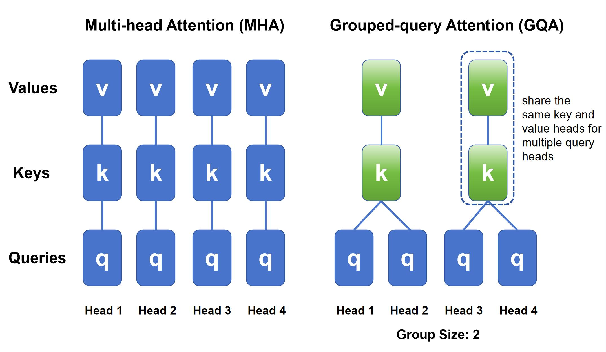

GQA（Grouped-Query Attention）将多个查询头（Query heads）分组，每组共享同一个键/值头（Key/Value head），在显著降低KV缓存和计算开销的同时，保持接近多头注意力（MHA）的模型性能。

它在MHA（多头）和MQA（单头KV）之间取得高效与性能的平衡，已成为LLaMA、Qwen、DeepSeek等主流大模型的标准组件。

## 一、GQA 的由来：为什么需要 GQA？

在标准的 **Multi-Head Attention（MHA）** 中：
- Query（Q）、Key（K）、Value（V） 都被分成 **h 个头**，每个头独立计算注意力。
- 推理时，K 和 V 需要缓存（KV Cache），总缓存大小为：  
  $$
  \text{Cache Size} = 2 \times h \times n \times d_k
  $$
  其中 $n$ 是上下文长度，$d_k$ 是每个 head 的维度。

当模型变大（如 LLaMA-65B，h=64），**KV Cache 占用大量显存**，成为推理瓶颈。



### 替代方案对比：

| 方法 | Q 头数 | K/V 头数 | KV Cache | 表达能力 |
|------|--------|----------|--------|--------|
| MHA（多头注意力） | h | h | 大 | 强 |
| MQA（多查询注意力） | h | 1 | 极小 | 弱（性能下降明显） |
| **GQA（分组查询注意力）** | h | g（g ≪ h） | **中等** | **接近 MHA** |

> 💡 GQA 由 Google 在 2023 年论文《[GQA: Training Generalized Multi-Query Transformer Models from Multi-Head Checkpoints](https://arxiv.org/abs/2305.13245)》提出，旨在 **平衡效率与性能**。

---

## 二、基本原理

- 将 **h 个 query heads 分成 g 组**（g 整除 h）
- 每组共享 **同一个 key head 和 value head**
- 因此，K/V 只需生成 **g 个 heads**，而不是 h 个

例如：
- h = 32, g = 8 → 每 4 个 Q heads 共享 1 个 K/V head
- KV Cache 减少为原来的 $ \frac{g}{h} = \frac{1}{4} $

> ✅ **关键思想**：并非所有 query 都需要独立的 key/value 视角；适度共享可大幅节省内存，而性能损失极小。

---

## 三、数学细节

设输入为 $ X \in \mathbb{R}^{n \times d_{\text{model}}} $

1. **线性投影**：
   $$
   Q = X W_Q \in \mathbb{R}^{n \times h d_q}, \quad
   K = X W_K \in \mathbb{R}^{n \times g d_k}, \quad
   V = X W_V \in \mathbb{R}^{n \times g d_v}
   $$
   其中通常 $ d_q = d_k = d_v = d_{\text{head}} $

2. **reshape**：
   - $ Q \rightarrow (n, h, d_{\text{head}}) $
   - $ K, V \rightarrow (n, g, d_{\text{head}}) $

3. **广播匹配**：
   - 将 K/V **重复**（或 view 扩展）为 (n, h, d_head)，使得每组 Q 对应相同的 K/V
   - 例如：若 h=8, g=2，则 K 变成 [k0,k0,k0,k0, k1,k1,k1,k1]

4. **Attention 计算**：
   $$
   \text{Attn}(Q, K, V) = \text{softmax}\left( \frac{Q K^\top}{\sqrt{d_{\text{head}}}} \right) V
   $$
   注意：Q 是 (n, h, d)，K/V 广播后也是 (n, h, d)，可直接点积

5. **输出拼接** → 投影回 $ d_{\text{model}} $

---

## 四、PyTorch 实现（可运行演示）

```python
import torch
import torch.nn as nn
import torch.nn.functional as F

class GroupedQueryAttention(nn.Module):
    def __init__(self, embed_dim, num_heads, num_groups, dropout=0.0):
        super().__init__()
        assert num_heads % num_groups == 0, "num_heads must be divisible by num_groups"
        
        self.embed_dim = embed_dim
        self.num_heads = num_heads
        self.num_groups = num_groups
        self.head_dim = embed_dim // num_heads
        
        # 总投影维度
        self.q_proj = nn.Linear(embed_dim, embed_dim, bias=False)
        self.k_proj = nn.Linear(embed_dim, self.head_dim * num_groups, bias=False)
        self.v_proj = nn.Linear(embed_dim, self.head_dim * num_groups, bias=False)
        self.out_proj = nn.Linear(embed_dim, embed_dim, bias=False)
        
        self.dropout = dropout

    def forward(self, x):
        # x: (batch_size, seq_len, embed_dim)
        B, N, D = x.shape
        
        # Project
        q = self.q_proj(x)  # (B, N, D)
        k = self.k_proj(x)  # (B, N, num_groups * head_dim)
        v = self.v_proj(x)  # (B, N, num_groups * head_dim)

        # Reshape Q: (B, N, num_heads, head_dim)
        q = q.view(B, N, self.num_heads, self.head_dim).transpose(1, 2)  # (B, num_heads, N, head_dim)

        # Reshape K/V: (B, N, num_groups, head_dim)
        k = k.view(B, N, self.num_groups, self.head_dim).transpose(1, 2)  # (B, num_groups, N, head_dim)
        v = v.view(B, N, self.num_groups, self.head_dim).transpose(1, 2)  # (B, num_groups, N, head_dim)

        # Broadcast K/V to match Q's head dimension
        # Repeat each group head for (num_heads // num_groups) times
        repeat_factor = self.num_heads // self.num_groups
        k = k.unsqueeze(2).expand(-1, -1, repeat_factor, -1, -1).flatten(1, 2)  # (B, num_heads, N, head_dim)
        v = v.unsqueeze(2).expand(-1, -1, repeat_factor, -1, -1).flatten(1, 2)  # (B, num_heads, N, head_dim)

        # Scaled dot-product attention
        scale = self.head_dim ** -0.5
        attn_scores = torch.matmul(q, k.transpose(-2, -1)) * scale  # (B, num_heads, N, N)
        attn_probs = F.softmax(attn_scores, dim=-1)
        attn_probs = F.dropout(attn_probs, p=self.dropout, training=self.training)

        out = torch.matmul(attn_probs, v)  # (B, num_heads, N, head_dim)
        out = out.transpose(1, 2).contiguous().view(B, N, D)  # (B, N, embed_dim)
        out = self.out_proj(out)
        return out


# ------------------ 演示 ------------------
if __name__ == "__main__":
    torch.manual_seed(0)
    batch_size = 2
    seq_len = 8
    embed_dim = 128
    num_heads = 8
    num_groups = 2  # GQA: 8 query heads, 2 key/value heads

    x = torch.randn(batch_size, seq_len, embed_dim)

    # GQA 模型
    gqa = GroupedQueryAttention(embed_dim, num_heads, num_groups)
    
    output = gqa(x)
    print("Input shape:", x.shape)      # [2, 8, 128]
    print("Output shape:", output.shape) # [2, 8, 128]

    # 验证参数量 vs MHA
    # MHA 会有 3 * embed_dim * embed_dim 参数（Q/K/V）
    # GQA 的 K/V 投影更小：
    total_params = sum(p.numel() for p in gqa.parameters())
    print(f"Total parameters in GQA layer: {total_params}")

    # 对比：如果是标准 MHA（num_heads=8, embed_dim=128）
    mha = nn.MultiheadAttention(embed_dim, num_heads, batch_first=True)
    mha_params = sum(p.numel() for p in mha.parameters())
    print(f"Standard MHA parameters: {mha_params}")
```

### 输出示例：
```
Input shape: torch.Size([2, 8, 128])
Output shape: torch.Size([2, 8, 128])
Total parameters in GQA layer: 49920
Standard MHA parameters: 65664
```

> 🔍 可见 GQA 显著减少了 K/V 投影的参数量（从 2×128×128 → 2×128×32），同时 KV Cache 也减少为 1/4。

---

## 五、补充说明

- **训练兼容性**：GQA 可通过 **蒸馏或微调** 从 MHA 模型迁移（原论文重点）
- **实际应用**：
  - LLaMA-2 / LLaMA-3：全部使用 GQA（7B: h=32, g=8；70B: h=64, g=8）
  - Qwen、DeepSeek、Falcon 等均采用 GQA
- **推理加速**：结合 **PagedAttention（vLLM）** 或 **TensorRT-LLM**，GQA 可极大提升吞吐

---

## 六、延伸思考

- 如果 `num_groups = num_heads` → 退化为 **MHA**
- 如果 `num_groups = 1` → 退化为 **MQA**
- GQA 是 **MHA 和 MQA 的广义形式**

---

希望这份总结能帮你彻底掌握 GQA！如果你想进一步看 **如何集成到完整 Transformer Block**，或对比 **GQA vs MQA 在长文本上的表现**，也可以继续提问。

## 七 、参考文献

[MQA(2019): Fast Transformer Decoding: One Write-Head is All You Need](https://arxiv.org/abs/1911.02150)
[GQA(2023): Training Generalized Multi-Query Transformer Models from Multi-Head Checkpoints](https://arxiv.org/abs/2305.13245)
