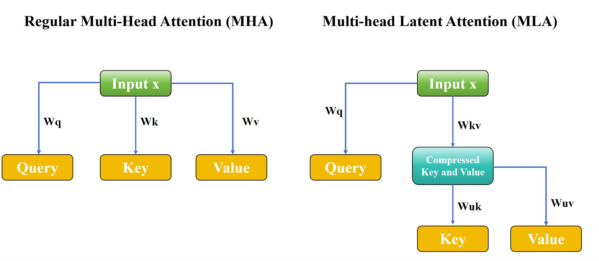

## 一、MLA 的由来

### 背景：KV Cache 成为推理瓶颈
在 Transformer 解码器中，自回归生成时需缓存所有历史 token 的 Key 和 Value（即 KV Cache）。随着上下文长度增长（如 32K、128K tokens），KV Cache 占用大量显存和带宽，成为推理效率的主要瓶颈。

### 目标：压缩 KV Cache
为减少 KV Cache 大小，研究者提出多种压缩方法：
- **MQA（Multi-Query Attention）**：所有头共享一组 K/V。
- **GQA（Grouped-Query Attention）**：将多个头分组共享 K/V。
- **MLA（Multi-head Latent Attention）**：**不直接存储原始 K/V，而是学习一个低维“潜在表示”（latent code），通过小型网络动态重建近似的 K/V**。

### 提出者与出处
- **DeepSeek-V2（2024）** 首次系统性提出并命名 **MLA（Multi-head Latent Attention）**。
- 核心思想：用 **低秩潜在向量 + 小型投影网络** 代替传统 KV Cache，大幅降低内存占用（论文称减少 77% KV Cache）。



---

## 二、基本原理

MLA 的核心思想是：

> **不显式存储每个 token 的 K 和 V，而是存储一个紧凑的“潜在向量” $ z_t \in \mathbb{R}^{d_z} $（$ d_z \ll d_k, d_v $），在需要时通过轻量级可学习映射 $ f_K, f_V $ 动态重建 K 和 V。**

具体流程：
1. 对每个输入 token $ x_t $，先计算一个 **共享的潜在表示 $ z_t $**。
2. 在 attention 计算时，对每个 head $ i $，用两个小型 MLP（或线性层）将 $ z_t $ 映射为该 head 的 $ k_{t,i} $ 和 $ v_{t,i} $。
3. 缓存的是 $ z_t $ 而非 $ k_t, v_t $，显著节省内存。

由于 $ z_t $ 维度远小于原始 K/V（例如 $ d_z = 128 $，而 $ d_k = d_v = 128 \times 8 = 1024 $），且重建网络参数量小，整体效率更高。

---

## 三、详细数学细节

设：
- 输入 token 表示：$ x_t \in \mathbb{R}^{d_{\text{model}}} $
- 潜在维度：$ d_z $
- 注意力头数：$ H $
- 每个 head 的 key/value 维度：$ d_k = d_v = d_h $

### 步骤 1：生成潜在向量
通过一个共享线性层生成潜在向量：
$$
z_t = W_z x_t + b_z \quad \in \mathbb{R}^{d_z}
$$
其中 $ W_z \in \mathbb{R}^{d_z \times d_{\text{model}}} $

> 实际实现中，$ z_t $ 可能经过 LayerNorm 或其他归一化。

### 步骤 2：按头重建 K 和 V
对每个 head $ h \in \{1, ..., H\} $，使用可学习的重建矩阵：
$
k_{t,h} = W_{K,h} z_t \quad \in \mathbb{R}^{d_h} \\
v_{t,h} = W_{V,h} z_t \quad \in \mathbb{R}^{d_h}
$
其中：
- $ W_{K,h} \in \mathbb{R}^{d_h \times d_z} $
- $ W_{V,h} \in \mathbb{R}^{d_h \times d_z} $

为减少参数量，通常将所有头的权重堆叠：
$
W_K \in \mathbb{R}^{H \cdot d_h \times d_z}, \quad
W_V \in \mathbb{R}^{H \cdot d_h \times d_z}
$

则可批量计算：
$
K = (W_K z_t) \in \mathbb{R}^{H d_h} \Rightarrow \text{reshape to } (H, d_h) \\
V = (W_V z_t) \in \mathbb{R}^{H d_h} \Rightarrow \text{reshape to } (H, d_h)
$

### 步骤 3：标准多头注意力计算
查询仍由传统方式生成（因 Q 不需缓存）：
$
Q = x_t W_Q \in \mathbb{R}^{H \times d_h}
$

然后进行标准 scaled dot-product attention：
$
\text{Attention}(Q, K, V) = \text{softmax}\left( \frac{Q K^\top}{\sqrt{d_h}} \right) V
$

### 缓存策略
- **缓存内容**：仅缓存 $ \{z_1, z_2, ..., z_t\} $，而非 $ K, V $。
- **缓存大小**：从 $ O(T \cdot H \cdot d_h) $ 降至 $ O(T \cdot d_z) $。
- 若 $ d_z \ll H \cdot d_h $（例如 $ d_z = 128 $, $ H=32, d_h=128 \Rightarrow H d_h = 4096 $），则压缩比达 **32x**。

---

## 四、PyTorch 实现（简化版）

以下是一个 **单层 MLA 注意力模块** 的 PyTorch 实现，用于演示原理：

```python
import torch
import torch.nn as nn
import torch.nn.functional as F

class MLAttention(nn.Module):
    def __init__(
        self,
        d_model: int,
        n_heads: int,
        d_head: int,
        d_latent: int,
        dropout: float = 0.1
    ):
        """
        Multi-head Latent Attention (MLA) as in DeepSeek-V2.
        Args:
            d_model: model dimension (e.g., 4096)
            n_heads: number of attention heads
            d_head: dimension per head (e.g., 128)
            d_latent: latent dimension for KV compression (e.g., 128)
        """
        super().__init__()
        self.d_model = d_model
        self.n_heads = n_heads
        self.d_head = d_head
        self.d_latent = d_latent
        self.scale = d_head ** -0.5

        # Query projection (not compressed)
        self.wq = nn.Linear(d_model, n_heads * d_head, bias=False)

        # Latent vector projection (shared for all heads)
        self.wz = nn.Linear(d_model, d_latent, bias=False)

        # Reconstruction matrices for K and V (per head, but stored as big matrices)
        self.wk_recon = nn.Parameter(torch.randn(n_heads * d_head, d_latent))
        self.wv_recon = nn.Parameter(torch.randn(n_heads * d_head, d_latent))

        # Output projection
        self.wo = nn.Linear(n_heads * d_head, d_model, bias=False)

        self.dropout = nn.Dropout(dropout)

        # Initialize reconstruction matrices (optional: Xavier)
        nn.init.xavier_uniform_(self.wk_recon)
        nn.init.xavier_uniform_(self.wv_recon)

    def forward(
        self,
        x: torch.Tensor,
        kv_cache: dict = None  # { 'z': [seq_len, d_latent] }
    ):
        """
        x: [batch, seq_len, d_model]
        kv_cache: optional dict to store/reuse latent vectors
        Returns:
            output: [batch, seq_len, d_model]
            new_kv_cache: updated cache with latent vectors
        """
        B, L, D = x.shape

        # Project queries
        q = self.wq(x)  # [B, L, H * dh]
        q = q.view(B, L, self.n_heads, self.d_head).transpose(1, 2)  # [B, H, L, dh]

        # Project to latent space
        z = self.wz(x)  # [B, L, d_latent]

        # Update KV cache
        if kv_cache is not None:
            if 'z' in kv_cache:
                z = torch.cat([kv_cache['z'], z], dim=1)  # prepend cached latents
            kv_cache['z'] = z.detach()  # update cache

        # Reconstruct K and V from latent vectors
        # z: [B, T, d_latent] where T = current total length
        T = z.size(1)
        # Reconstruct all K and V at once
        k_flat = F.linear(z, self.wk_recon)  # [B, T, H * dh]
        v_flat = F.linear(z, self.wv_recon)  # [B, T, H * dh]

        k = k_flat.view(B, T, self.n_heads, self.d_head).transpose(1, 2)  # [B, H, T, dh]
        v = v_flat.view(B, T, self.n_heads, self.d_head).transpose(1, 2)  # [B, H, T, dh]

        # Scaled dot-product attention
        attn_scores = torch.matmul(q, k.transpose(-2, -1)) * self.scale  # [B, H, L, T]
        attn_weights = F.softmax(attn_scores, dim=-1)
        attn_weights = self.dropout(attn_weights)

        output = torch.matmul(attn_weights, v)  # [B, H, L, dh]
        output = output.transpose(1, 2).contiguous().view(B, L, -1)  # [B, L, H*dh]

        output = self.wo(output)
        return output, kv_cache

# 示例使用
if __name__ == "__main__":
    batch_size = 2
    seq_len = 8
    d_model = 512
    n_heads = 8
    d_head = 64
    d_latent = 128  # << n_heads * d_head = 512

    x = torch.randn(batch_size, seq_len, d_model)
    mla = MLAttention(d_model, n_heads, d_head, d_latent)

    # First forward (no cache)
    out1, cache = mla(x, kv_cache={})
    print("Output shape:", out1.shape)      # [2, 8, 512]
    print("Cache z shape:", cache['z'].shape)  # [2, 8, 128]

    # Next token (simulate autoregressive)
    next_token = torch.randn(batch_size, 1, d_model)
    out2, cache = mla(next_token, kv_cache=cache)
    print("After one more token, cache z shape:", cache['z'].shape)  # [2, 9, 128]
```

---

## 五、优势与局限

### ✅ 优势
- **KV Cache 压缩率高**：缓存从 $ O(H d_h) $ 降至 $ O(d_z) $，典型压缩比 4x–32x。
- **推理显存大幅降低**：适合长上下文部署。
- **训练兼容性好**：端到端可训练，无需修改损失函数。

### ⚠️ 局限
- **重建误差**：K/V 是近似重建，可能影响模型表达能力（但 DeepSeek-V2 表明影响可控）。
- **额外计算开销**：每次 attention 都需重建 K/V，增加 FLOPs（但内存带宽往往是瓶颈，计算换内存值得）。
- **需调整训练策略**：潜在空间需充分学习，可能需更大学习率或 warmup。

---

## 六、总结

**MLA（Multi-head Latent Attention）** 是一种面向高效推理的注意力机制创新，通过引入**低维潜在表示 + 动态重建**，显著压缩 KV Cache，已在 DeepSeek-V2 等工业级大模型中验证有效性。它代表了“**用计算换内存**” 的现代大模型优化范式。

> 🔍 注：若你在其他文献中看到 “MLA” 指代不同概念（如 Multi-Layer Attention、Meta-Learning Attention 等），请结合上下文判断。但在 2024–2026 年大模型效率优化语境下，**MLA ≈ Multi-head Latent Attention（DeepSeek-V2）**。

---

### 参考资料

- DeepSeek-V2 Technical Report (2024). https://github.com/deepseek-ai/DeepSeek-V2
- "Efficient Transformers: A Survey" (2022+)
- Google’s **AFT**、Meta’s **MQA/GQA** 等相关工作
