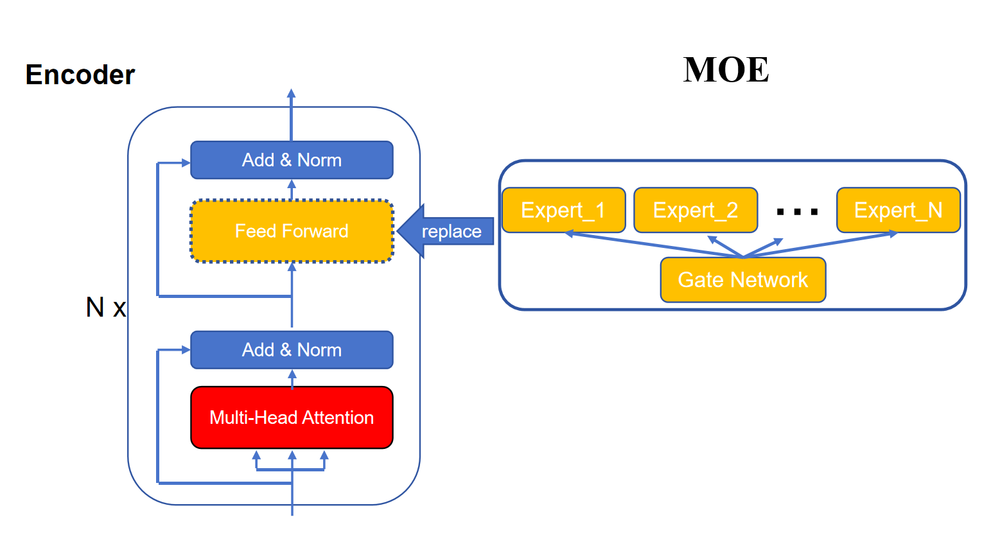

混合专家（Mixture of Experts, MoE）是一种**条件计算（conditional computation）**架构，旨在在不显著增加计算成本的前提下扩展模型容量。它已被广泛应用于现代大语言模型（如 Google 的 GLaM、Mixtral、Qwen-MoE、DeepSeek-MoE 等）。

## MoE 的核心思想

- 🎯 目标：
    - 扩大模型参数量（提升表达能力）
    - 保持每次前向计算的 FLOPs 基本不变（高效推理）
- 🔑 关键机制：
    - 模型由多个“专家”（Experts）组成，每个专家是一个子网络（如 FFN）。
    - 引入一个门控网络（Gating Network），根据输入动态决定激活哪几个专家。
    - 通常只激活 Top-K 个专家（如 K=1 或 K=2），其余专家不参与计算。
> ✅ 这样：总参数量 = 所有专家参数之和（很大），但每 token 计算量 ≈ K 个专家（很小）。

## MoE给Transformer架构带来的改变

下面我们从 Transformer 架构出发，深入讲解 MoE（Mixture of Experts）的数学形式、门控机制来源、专家模块在 Transformer 中的具体位置与作用

### MoE 在 Transformer 中的位置

在标准 Transformer 中，每个 Transformer 层包含两个核心子模块：

- 多头注意力（Multi-Head Attention, MHA）
- 前馈网络（Feed-Forward Network, FFN）
> ✅ MoE 通常只替换 FFN 部分，而保留 MHA 不变。

也就是说，一个 MoE Transformer 层的结构为：



**因此，MoE 是 FFN 的“超集”：传统 FFN = 1 个专家；MoE = 多个专家 + 动态路由。**

### 传统 FFN 的数学形式（作为对比）

标准 FFN（两层 MLP）：
$$
\text{FFN}(x) = W_2 \sigma(W_1 x + b_1) + b_2
$$

其中：

- $x \in \mathbb{R}^d$：输入 token 表示  
- $W_1 \in \mathbb{R}^{h \times d}, W_2 \in \mathbb{R}^{d \times h}$  
- $\sigma$：激活函数（如 ReLU、SwiGLU）

所有 token 都经过同一个 FFN。

### MoE 的数学形式

#### 专家集合定义

设有 E 个专家，每个专家是一个独立的 FFN：
$$
\text{Expert}_i(x) = W_{i,2} \sigma(W_{i,1} x + b_{i,1}) + b_{i,2}
$$

> 注意：通常省略偏置项以简化分布式训练。

所有专家参数不共享，总参数量 ≈ E×（单个 FFN 参数量）

#### 门控网络（Gating Network）

##### 门控打分（logits）：

$$
g_i = W_g x_i \in \mathbb{R}^E
$$

其中 $W_g \in \mathbb{R}^{E \times d}$ 是可学习的路由权重矩阵。

> 💡 **门控从哪里来？**  
> 它是一个额外的小型线性层，输入是 token 表示 $x_i$，输出是 $E$ 个专家的打分。  
> 它是 MoE 模块的一部分，与专家一起训练。

假定门控网络的输入为X: [bs, seq_len, hidden_dim]，则门控网络的权重参数为W: [hidden_dim, E],其中E为 MoE 的专家数量：

$$
\text{logits} = W_g X， 其中W_g \in \mathbb{R}^{E \times \text{hidden\_dim}}
$$

然后接一个softmax得到概率分布：

$$
p = \text{softmax}(W_g X) \in \mathbb{R}^E
$$


##### Top-K 选择：

选取概率最大的 $K$ 个专家（通常 $K=1$ 或 $2$）：

$$
\mathcal{K}_i = \text{TopK}(p_i, K)
$$

对应的权重为 $p_i^{(k)}$（归一化或保持原值）。

> ⚠️ 实际实现中，为了可微分，即使只用 Top-K，梯度仍通过 Softmax 回传（但只对选中的专家计算前向）。

---

#### MoE 输出（加权组合）

最终输出为选中专家的加权和：

$$
y_i = \sum_{e \in \mathcal{K}_i} p_i^{(e)} \cdot \text{Expert}_e(x_i)
$$

> ✅ 这就是 MoE 的核心：**每个 token 走不同的“子网络”路径**。


### 实际挑战与解决方案

#### 1. 专家负载不均衡（Expert Collapse）

- 某些专家被频繁使用，其他“闲置”
- 导致模型容量浪费，甚至训练不稳定

✅ **解决方案：辅助负载均衡损失（Auxiliary Loss）**

##### 定义：

- $f_e = \dfrac{\text{分配给专家 } e \text{ 的 token 数}}{\text{总 token 数}}$ → 实际使用频率
- $P_e = \text{所有 token 对专家 } e \text{ 的平均 softmax 概率}$

##### 辅助损失：

$$
\mathcal{L}_{\text{aux}} = E \cdot \sum_{e=1}^E f_e \cdot P_e
$$

- 最小化该损失 ⇒ 鼓励高概率专家被实际使用，低频专家提高概率
- 总损失：$\mathcal{L} = \mathcal{L}_{\text{task}} + \alpha \mathcal{L}_{\text{aux}}$（$\alpha \approx 0.01$）

### MOE基本原理的pytorch实现

```python
import torch
import torch.nn as nn
import torch.nn.functional as F

class SimpleExpert(nn.Module):
    """单个专家：两层线性变换 + ReLU"""
    def __init__(self, hidden_dim: int, ffn_dim: int):
        super().__init__()
        self.w1 = nn.Linear(hidden_dim, ffn_dim, bias=False)
        self.w2 = nn.Linear(ffn_dim, hidden_dim, bias=False)
        self.act = nn.ReLU()

    def forward(self, x):
        # x: (N, hidden_dim)
        return self.w2(self.act(self.w1(x)))  # (N, hidden_dim)

class SimpleMoE(nn.Module):
    def __init__(
        self,
        hidden_dim: int = 64,
        ffn_dim: int = 128,
        num_experts: int = 4,
        top_k: int = 1,
        aux_loss_coef: float = 0.01,
    ):
        super().__init__()
        self.hidden_dim = hidden_dim
        self.num_experts = num_experts
        self.top_k = top_k
        self.aux_loss_coef = aux_loss_coef

        # 创建多个专家
        self.experts = nn.ModuleList([
            SimpleExpert(hidden_dim, ffn_dim) for _ in range(num_experts)
        ])
        # 门控网络：将 token 映射到专家 logits
        self.gate = nn.Linear(hidden_dim, num_experts, bias=False)

    def forward(self, x: torch.Tensor):
        """
        x: (batch_size, seq_len, hidden_dim)
        Returns:
            output: (batch_size, seq_len, hidden_dim)
            aux_loss: scalar tensor
        """
        batch_size, seq_len, hidden_dim = x.shape
        N = batch_size * seq_len  # 总 token 数

        # [bs, seq_len, hidden_dim] -> [N, hidden_dim]
        x_flat = x.view(N, hidden_dim)  # (N, hidden_dim)

        # === Step 1: 门控打分 ===
        gate_logits = self.gate(x_flat)  # (N, E), E = num_experts
        gate_probs = F.softmax(gate_logits, dim=-1)  # (N, E)

        # === Step 2: Top-K 选择（这里用 Top-1）===
        topk_probs, topk_indices = torch.topk(gate_probs, self.top_k, dim=-1)  # (N, K), (N, K)
        # 构建 one-hot 风格路由掩码
        mask = torch.zeros_like(gate_probs).scatter_(-1, topk_indices, 1.0)  # (N, E)

        # === Step 3: 计算辅助负载均衡损失 ===
        # f_e: 每个专家被选中的频率 (E,)
        f = mask.float().mean(dim=0)  # (E,)
        # P_e: 每个专家的平均 softmax 概率 (E,)
        P = gate_probs.mean(dim=0)   # (E,)
        aux_loss = torch.sum(f * P) * self.num_experts  # scalar

        # === Step 4: 路由并计算输出 ===
        output_flat = torch.zeros_like(x_flat)  # (N, hidden_dim)

        # 对每个专家，找出分配给它的 token
        for e in range(self.num_experts):
            # idx: 分配给专家 e 的 token 索引 (M,)
            idx = torch.where(mask[:, e] > 0)[0]
            if idx.numel() == 0:
                continue
            expert_input = x_flat[idx]  # (M, hidden_dim)
            expert_output = self.experts[e](expert_input)  # (M, hidden_dim)
            # 使用原始 softmax 概率作为权重（不是归一化后的）
            weights = gate_probs[idx, e].unsqueeze(1)  # (M, 1)
            output_flat[idx] += weights * expert_output  # (M, hidden_dim)

        output = output_flat.view(batch_size, seq_len, hidden_dim)  # (bs, seq_len, hidden_dim)
        return output, self.aux_loss_coef * aux_loss


# ==============================
# 演示用法
# ==============================
if __name__ == "__main__":
    # 设置参数
    bs, seq_len, hidden_dim = 2, 5, 64
    x = torch.randn(bs, seq_len, hidden_dim)

    # 初始化 MoE 层
    moe = SimpleMoE(
        hidden_dim=hidden_dim,
        ffn_dim=128,
        num_experts=4,
        top_k=1,
        aux_loss_coef=0.01
    )

    # 前向传播
    output, aux_loss = moe(x)

    print("Input shape:", x.shape)          # torch.Size([2, 5, 64])
    print("Output shape:", output.shape)    # torch.Size([2, 5, 64])
    print("Aux loss:", aux_loss.item())     # scalar, e.g., 0.04

    # 模拟任务损失（例如 MSE）
    target = torch.randn_like(output)
    task_loss = F.mse_loss(output, target)
    total_loss = task_loss + aux_loss

    print("Task loss:", task_loss.item())
    print("Total loss:", total_loss.item())

    # 反向传播（验证梯度是否正常）
    total_loss.backward()
    print("Backward passed! Gradients computed.")
```
