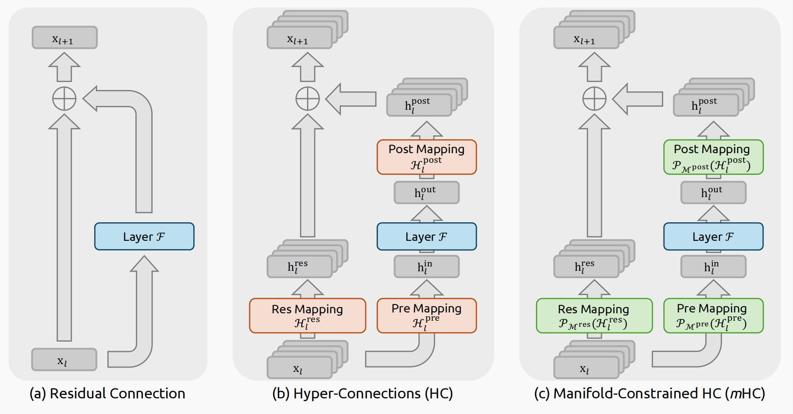

Ref: [mHC: Manifold-Constrained Hyper-Connections ](https://arxiv.org/abs/2512.24880v1)



## Introduction

自从ResNets的提出，深度神经网络架构经历了快速的演进。一个常规的ResNet层结果如上面图(a)所示，其数学表达式描述为：

$$
\mathbf{x}_{l+1} = \mathbf{x}_l + \mathcal{F}(\mathbf{x}_l, W_l)             \tag{1}
$$

其中$\mathbf{x}_l$和$\mathbf{x}_{l+1}$表示输入和输出向量，是一个$C$维度的向量。$\mathcal{F}$表示残差函数，$W_l$表示权重矩阵。尽管残差函数F在过去十年中已发展出卷积、注意力机制和前馈网络等多种操作，但残差连接的范式仍保持其原始形式。随着Transformer架构的发展，该范式目前已确立为大型语言模型（LLMs）的基本设计元素。

这一成功主要归功于残差连接的简洁形式。更重要的是，早期研究揭示了残差连接的恒等映射特性在大规模训练中保持稳定性和效率。通过递归扩展残差连接跨越多层，等式（1）得出：

$$
\mathbf{x}_{L} = \mathbf{x}_l + \sum_{i=l}^{L-1} \mathcal{F}(\mathbf{x}_l, W_l)             \tag{2}
$$

其中$L$和$l$分别对应较深和较浅的层。恒等映射项指的是组件$x_l$本身，强调了来自较浅层的信号未经任何修改直接映射到较深层的特性。

近期，以超连接（Hyper-Connections，HC）（Zhu 等人，2024）为代表的研究为残差连接引入了新维度，并通过实证验证了其性能潜力。HC的单层架构如图1(b)所示。通过扩展残差流宽度并增强连接复杂度，HC在不改变单个单元浮点运算（FLOPs）计算开销的前提下，显著提升了拓扑复杂度。形式化地，HC中的单层传播定义为：

$$
\mathbf{x}_{l+1} = \mathcal{H}_l^{\text{res}} \mathbf{x}_l + \mathcal{H}_l^{\text{post}}{}^\top \mathcal{F}(\mathcal{H}_l^{\text{pre}}   \mathbf{x}_l, W_l)    \tag{3}
$$

其中，$\mathbf{x}_l$ 和 $\mathbf{x}_{l+1}$ 分别表示第 $l$ 层的输入和输出。与公式 (1) 中的表述不同，$\mathbf{x}_l$ 和 $\mathbf{x}_{l+1}$ 的特征维度从 $C$ 扩展到了 $n \times C$，其中 $n$ 是扩展倍率（expansion rate）。项 $\mathcal{H}_l^{\text{res}} \in \mathbb{R}^{n \times n}$ 表示一个可学习的映射，用于在残差流（residual stream）内部混合特征。同样作为可学习映射，$\mathcal{H}_l^{\text{pre}} \in \mathbb{R}^{1 \times n}$ 将来自 $nC$ 维流中的特征聚合为一个 $C$ 维的层输入；反之，$\mathcal{H}_l^{\text{post}} \in \mathbb{R}^{1 \times n}$ 将层的输出重新映射回原始流中。

然而，随着训练规模的增加，HC引入了潜在的不稳定性风险。主要担忧在于，当架构扩展到多层时，HC的无约束特性会损害恒等映射属性。在包含多个并行流的架构中，理想的恒等映射充当了守恒机制，确保在前向和反向传播过程中流间的平均信号强度保持不变。

在 HC（Hyper-Connection）的公式化中，可学习映射由两部分系数组成：依赖输入的部分和全局的部分，分别称为**动态映射**（dynamic mappings）和**静态映射**（static mappings）。  
形式上，HC 按如下方式计算这些系数：

$$
\begin{cases}
\tilde{\mathbf{x}}_l = \text{RMSNorm}(\mathbf{x}_l) \\
\mathcal{H}_l^{\text{pre}} = \alpha_l^{\text{pre}} \cdot \tanh(\theta_l^{\text{pre}} \tilde{\mathbf{x}}_l^\top) + \mathbf{b}_l^{\text{pre}} \\
\mathcal{H}_l^{\text{post}} = \alpha_l^{\text{post}} \cdot \tanh(\theta_l^{\text{post}} \tilde{\mathbf{x}}_l^\top) + \mathbf{b}_l^{\text{post}} \\
\mathcal{H}_l^{\text{res}} = \alpha_l^{\text{res}} \cdot \tanh(\theta_l^{\text{res}} \tilde{\mathbf{x}}_l^\top) + \mathbf{b}_l^{\text{res}}
\end{cases}
\tag{4}
$$

其中，$\text{RMSNorm}(\cdot)$（Zhang and Sennrich, 2019）应用于最后一个维度，标量 $\alpha_l^{\text{pre}}, \alpha_l^{\text{post}}, \alpha_l^{\text{res}} \in \mathbb{R}$ 是可学习的门控因子，初始化为较小的值。  
动态映射通过线性投影得到，其参数为 $\theta_l^{\text{pre}}, \theta_l^{\text{post}} \in \mathbb{R}^{1 \times C}$ 和 $\theta_l^{\text{res}} \in \mathbb{R}^{n \times C}$；而静态映射则由可学习的偏置项表示：$\mathbf{b}_l^{\text{pre}}, \mathbf{b}_l^{\text{post}} \in \mathbb{R}^{1 \times n}$ 和 $\mathbf{b}_l^{\text{res}} \in \mathbb{R}^{n \times n}$。

## m-HC 

鉴于HC方法在训练上的不稳定性，DeepSeek团队通过分析发现主要是由于变换$\tilde{\mathcal{H}}_l^{\text{res}}$不是模守恒的，因此引入了m-HC。这里详细阐述了 m-HC 中 $\mathcal{H}_l^{\text{pre}}$、$\mathcal{H}_l^{\text{post}}$ 和 $\mathcal{H}_l^{\text{res}}$ 的计算过程。给定第 $l$ 层的输入隐藏矩阵 $\mathbf{x}_l \in \mathbb{R}^{n \times C}$，我们首先将其展平为一个向量 $\tilde{\mathbf{x}}_l = \mathrm{vec}(\mathbf{x}_l) \in \mathbb{R}^{1 \times nC}$，以保留完整的上下文信息。接着，我们遵循原始 HC 的公式，计算动态映射和静态映射如下：

$$
\begin{cases}
\tilde{\mathbf{x}}'_l = \text{RMSNorm}(\tilde{\mathbf{x}}_l) \\
\tilde{\mathcal{H}}_l^{\text{pre}} = \alpha_l^{\text{pre}} \cdot (\tilde{\mathbf{x}}'_l \varphi_l^{\text{pre}}) + \mathbf{b}_l^{\text{pre}} \\
\tilde{\mathcal{H}}_l^{\text{post}} = \alpha_l^{\text{post}} \cdot (\tilde{\mathbf{x}}'_l \varphi_l^{\text{post}}) + \mathbf{b}_l^{\text{post}} \\
\tilde{\mathcal{H}}_l^{\text{res}} = \alpha_l^{\text{res}} \cdot \mathrm{mat}(\tilde{\mathbf{x}}'_l \varphi_l^{\text{res}}) + \mathbf{b}_l^{\text{res}}
\end{cases}
\tag{5}
$$

其中，$\varphi_l^{\text{pre}}, \varphi_l^{\text{post}} \in \mathbb{R}^{nC \times n}$ 和 $\varphi_l^{\text{res}} \in \mathbb{R}^{nC \times n^2}$ 是用于动态映射的线性投影矩阵，而 $\mathrm{mat}(\cdot)$ 是一个从 $\mathbb{R}^{1 \times n^2}$ 到 $\mathbb{R}^{n \times n}$ 的 reshape 函数。然后，最终的约束映射通过以下方式获得：

$$
\begin{cases}
\mathcal{H}_l^{\text{pre}} = \sigma(\tilde{\mathcal{H}}_l^{\text{pre}}) \\
\mathcal{H}_l^{\text{post}} = 2\sigma(\tilde{\mathcal{H}}_l^{\text{post}}) \\
\mathcal{H}_l^{\text{res}} = \text{Sinkhorn-Knopp}(\tilde{\mathcal{H}}_l^{\text{res}})
\end{cases}
\tag{6}
$$

其中，$\sigma(\cdot)$ 表示 Sigmoid 函数。Sinkhorn-Knopp 操作符首先通过指数运算使所有元素为正，然后进行迭代归一化过程：交替对行和列进行缩放，使其和为 1。具体而言，给定一个正矩阵 $\mathbf{M}^{(0)} = \exp(\tilde{\mathcal{H}}_l^{\text{res}})$ 作为起点，归一化迭代过程如下：

$$
\mathbf{M}^{(t)} = \mathcal{T}_r\left( \mathcal{T}_c(\mathbf{M}^{(t-1)}) \right),
\tag{7}
$$

其中，$\mathcal{T}_r$ 和 $\mathcal{T}_c$ 分别表示行归一化和列归一化操作。该过程收敛到一个双随机矩阵 $\mathcal{H}_l^{\text{res}} = \mathbf{M}^{(t_{\max})}$，当 $t_{\max} \to \infty$ 时成立。在我们的实验中，选择 $t_{\max} = 20$ 作为一个实用的迭代次数。

---
- 在 HC（Hyper-Connection）与 m-HC（Manifold-Constrained Hyper-Connection）两种方法中，输入 $\mathbf{x}_l \in \mathbb{R}^C$ 的维度从单一流（single stream）被扩展为 $n \times C$，其本质可理解为：**将原始隐藏状态复制并并行化为 $n$ 个相互独立的“信息流”（information streams）**。尽管该操作在形式上表现为维度的线性扩展，但其核心意图是构建一个**多通道表示空间**，为后续的动态调制提供结构化基础。

- 相较于原始 HC 方法，m-HC 并未改变 $\mathcal{H}_l^{\text{pre}}$、$\mathcal{H}_l^{\text{post}}$ 与 $\mathcal{H}_l^{\text{res}}$ 的整体数学形式，而是**重构了其计算机制**：HC 通过局部投影矩阵对每个通道独立建模，而 m-HC 则通过**全局展平与统一线性映射**（$\tilde{\mathbf{x}}'_l = \mathrm{vec}(\tilde{\mathbf{x}}_l)$）实现对整个多流表示的联合建模。这一设计不仅提升了参数效率，也增强了跨通道的信息交互能力。

- 尤为关键的是，m-HC 对残差映射 $\mathcal{H}_l^{\text{res}}$ 引入了 **Sinkhorn-Knopp 算法**，将其约束为一个双随机矩阵（doubly stochastic matrix）。该操作强制残差路径在 $n$ 个信息流之间实现**信息守恒与均衡分配**，有效缓解了梯度消失与路径偏置问题，显著提升了训练的稳定性与收敛性。

- 从 MoE（Mixture of Experts）的专家并行，到 Multi-Head Attention 的多头注意力机制，再到 m-HC 的结构化多流调制，我们观察到一种清晰的演进范式：**模型不断将单一、同质的信息流，解耦为多个异构的并行通道，并通过可学习的投影与约束机制，重新聚合为统一的输出表示**。这一模式的本质，是**从“单一路径决策”转向“多路径协商与结构化融合”**，既保留了并行计算的效率，又通过显式约束增强了表达的鲁棒性与几何一致性。m-HC 正是在这一演化脉络中，首次将**流形约束**（manifold constraint）引入超连接结构，为下一代高效、稳定的大模型架构提供了新的设计范式。

---

## Pytorch实现参考

下面代码由Qwen3-Next模型帮忙实现：

```python
import torch
import torch.nn as nn
import torch.nn.functional as F
from typing import Optional

class DeepSeekmHCDecoderLayer(nn.Module):
    def __init__(self, d_model: int, n_heads: int, n_expansion: int = 4, dropout: float = 0.1, sinkhorn_iters: int = 20):
        """
        DeepSeek mHC Decoder Layer - 严格复现论文公式 (7)
        输入 x_l ∈ (B, L, d_model) → 展平为 (B, L, n*d_model) → 线性映射为 H_pre ∈ (B, L, 1, n)
        """
        super().__init__()
        self.d_model = d_model
        self.n = n_expansion
        self.sinkhorn_iters = sinkhorn_iters
        self.input_dim_flat = n_expansion * d_model  # n * C

        # === 1. Self-Attention ===
        self.self_attn = nn.MultiheadAttention(d_model, n_heads, dropout=dropout, batch_first=True)

        # === 2. Cross-Attention ===
        self.cross_attn = nn.MultiheadAttention(d_model, n_heads, dropout=dropout, batch_first=True)

        # === 3. mHC: 展平输入后，用三个全局投影矩阵 φ ===
        # φ_pre ∈ (nC, n), φ_post ∈ (nC, n), φ_res ∈ (nC, n²)
        self.phi_pre = nn.Linear(self.input_dim_flat, n_expansion, bias=False)
        self.phi_post = nn.Linear(self.input_dim_flat, n_expansion, bias=False)
        self.phi_res = nn.Linear(self.input_dim_flat, n_expansion * n_expansion, bias=False)

        # === 4. 标量门控 α (初始化为小值) ===
        self.alpha_pre = nn.Parameter(torch.tensor(0.1))
        self.alpha_post = nn.Parameter(torch.tensor(0.1))
        self.alpha_res = nn.Parameter(torch.tensor(0.1))

        # === 5. 静态偏置 b ===
        self.b_pre = nn.Parameter(torch.zeros(1, n_expansion))      # (1, n)
        self.b_post = nn.Parameter(torch.zeros(1, n_expansion))     # (1, n)
        self.b_res = nn.Parameter(torch.zeros(n_expansion, n_expansion))  # (n, n)

        # === 6. 前馈网络（Gated MLP）===
        self.ffn = nn.Sequential(
            nn.Linear(d_model, d_model * 4),
            nn.GELU(),
            nn.Linear(d_model * 4, d_model),
            nn.Dropout(dropout)
        )

        # === 7. 归一化 ===
        self.norm1 = nn.RMSNorm(d_model)   # RMSNorm
        self.norm2 = nn.RMSNorm(d_model)
        self.norm3 = nn.RMSNorm(d_model)

        # === 8. Dropout ===
        self.dropout1 = nn.Dropout(dropout)
        self.dropout2 = nn.Dropout(dropout)
        self.dropout3 = nn.Dropout(dropout)

    def sinkhorn_knopp(self, M: torch.Tensor, max_iters: int = 20) -> torch.Tensor:
        """Sinkhorn-Knopp 迭代归一化，输入为 (B, L, n, n)"""
        M = torch.exp(M)  # 转为正数
        for _ in range(max_iters):
            M = M / M.sum(dim=-1, keepdim=True)  # 行归一化
            M = M / M.sum(dim=-2, keepdim=True)  # 列归一化
        return M

    def forward(self,
                tgt: torch.Tensor,
                memory: torch.Tensor,
                tgt_mask: Optional[torch.Tensor] = None,
                memory_mask: Optional[torch.Tensor] = None,
                tgt_key_padding_mask: Optional[torch.Tensor] = None,
                memory_key_padding_mask: Optional[torch.Tensor] = None):

        B, L, C = tgt.shape  # C = d_model

        # === 1. Self-Attention with mHC ===
        tgt_norm = self.norm1(tgt)  # (B, L, C)

        # --- 自注意力主路径 ---
        tgt2, _ = self.self_attn(tgt_norm, tgt_norm, tgt_norm, attn_mask=tgt_mask,
                                 key_padding_mask=tgt_key_padding_mask)
        tgt2 = self.dropout1(tgt2)

        # --- 展平输入为 1×(n×C) 向量：用于公式 (7) 的 \tilde{x}'_l ---
        # 将每个位置的 C 维向量，复制 n 份 → 形成 (B, L, n, C)，然后展平为 (B, L, n*C)
        x_flat = tgt_norm.unsqueeze(-2).expand(B, L, self.n, C).reshape(B, L, self.n * C)  # (B, L, nC)

        # --- 计算公式 (7) 的三个动态映射 ---
        # \tilde{H}_l^pre = α_pre * (x_flat @ φ_pre) + b_pre
        # x_flat: (B, L, nC), φ_pre: (nC, n) → 输出 (B, L, n)
        H_tilde_pre = self.alpha_pre * self.phi_pre(x_flat) + self.b_pre  # (B, L, n)
        H_tilde_post = self.alpha_post * self.phi_post(x_flat) + self.b_post  # (B, L, n)
        H_tilde_res = self.alpha_res * self.phi_res(x_flat).view(B, L, self.n, self.n) + self.b_res  # (B, L, n, n)

        # --- 应用约束：公式 (8) ---
        H_pre = torch.sigmoid(H_tilde_pre).unsqueeze(-2)  # (B, L, 1, n)
        H_post = 2 * torch.sigmoid(H_tilde_post).unsqueeze(-2)  # (B, L, 1, n)
        H_res = self.sinkhorn_knopp(H_tilde_res, self.sinkhorn_iters)  # (B, L, n, n)

        # --- 主干变换：先用 H_pre 聚合，再过 ffn，再用 H_post 调制 ---
        # 注意：这里没有 W_exp！而是直接用 H_pre 作为聚合权重
        # 我们需要一个“聚合”操作：对每个位置，将 n 份相同的 x_flat 用 H_pre 加权
        # 但注意：x_flat 是展平后的向量，我们想对原始 x_norm 做加权平均
        # 所以：x_agg = H_pre @ x_norm → 但 x_norm 是 (B, L, C)，H_pre 是 (B, L, 1, n)
        # 我们需要将 x_norm 扩展为 (B, L, n, C)，然后做加权平均

        x_expanded = tgt_norm.unsqueeze(-2).expand(B, L, self.n, C)  # (B, L, n, C)
        x_agg = torch.einsum('bl1n,blnc->blc', H_pre, x_expanded)  # (B, L, C)

        # 主干变换：FFN
        x_main = self.ffn(x_agg)  # (B, L, C)

        # 用 H_post 调制输出
        x_main_expanded = x_main.unsqueeze(-2).expand(B, L, self.n, C)  # (B, L, n, C)
        x_post = torch.einsum('bl1n,blnc->blc', H_post, x_main_expanded)  # (B, L, C)

        # --- 残差路径：H_res 作用于 x_expanded (即 n 份 x_norm) ---
        # H_res: (B, L, n, n), x_expanded: (B, L, n, C)
        x_res = torch.einsum('blnn,blnc->blnc', H_res, x_expanded)  # (B, L, n, C)
        x_res = x_res + x_expanded  # 残差连接
        x_res_agg = x_res.mean(dim=-2)  # 平均聚合 → (B, L, C)

        # --- 最终输出：注意力 + mHC主干 + mHC残差 ---
        tgt = tgt + tgt2 + x_post + x_res_agg

        # === 2. Cross-Attention ===
        tgt_norm2 = self.norm2(tgt)
        tgt2, _ = self.cross_attn(tgt_norm2, memory, memory, attn_mask=memory_mask,
                                  key_padding_mask=memory_key_padding_mask)
        tgt2 = self.dropout2(tgt2)
        tgt = tgt + tgt2

        # === 3. Feed Forward ===
        tgt_norm3 = self.norm3(tgt)
        tgt2 = self.ffn(tgt_norm3)
        tgt2 = self.dropout3(tgt2)
        tgt = tgt + tgt2

        return tgt

if __name__ == '__main__':
    # 参数设置
    d_model = 512
    n_heads = 8
    n_expansion = 4
    batch_size = 2
    seq_len = 10
    memory_len = 15

    layer = DeepSeekmHCDecoderLayer(d_model=d_model, n_heads=n_heads, n_expansion=n_expansion)

    tgt = torch.randn(batch_size, seq_len, d_model)
    memory = torch.randn(batch_size, memory_len, d_model)

    output = layer(tgt, memory)
    print("Output shape:", output.shape)  # torch.Size([2, 10, 512])
```
