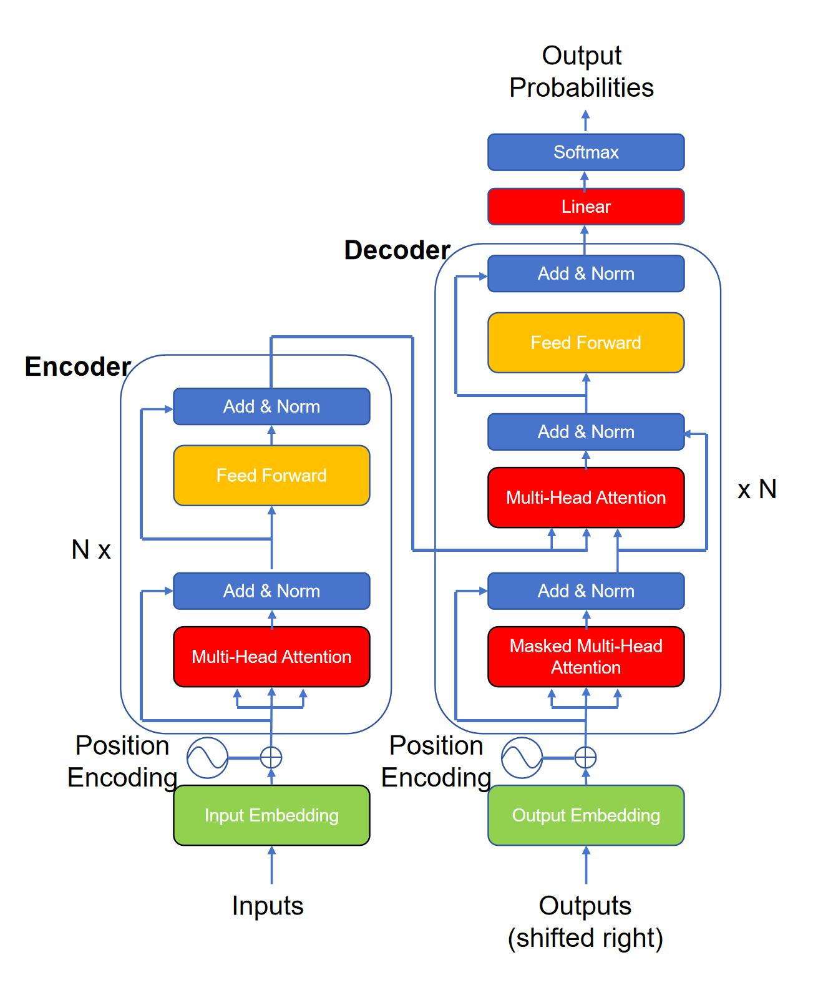

## Transformer的诞生背景

在深度学习的世界里，序列建模一直是个老大难问题。传统的循环神经网络(RNN)虽然能够处理序列数据，但在处理长序列时存在梯度消失和计算效率低下的问题。而卷积神经网络(CNN)虽然并行化程度高，但在捕捉长距离依赖关系方面力不从心。

就在这个关键时刻，Google的大神们在2017年扔出了一个"核弹级"的解决方案——《Attention Is All You Need》。这篇论文彻底颠覆了人们对序列建模的认知，提出了完全基于注意力机制的Transformer架构。



## 翻译任务：Transformer的试验场

Transformer最初是为了机器翻译任务而设计的。想象一下，你要把一句中文翻译成英文：

**中文输入**: "我喜欢学习人工智能"

**英文输出**: "I like studying artificial intelligence"

在这个过程中，模型需要理解每个词的含义，并找到它们之间的对应关系。传统的Seq2Seq模型依赖RNN来编码输入序列，但效果有限。而Transformer通过自注意力机制，能够同时关注输入序列中的所有位置，大大提升了翻译质量。

## Transformer的基本输入输出

### 输入的秘密

Transformer的输入其实很简单，就是一个个token（可以是单词、子词或者字符）。假设我们的词汇表大小为`[vocab_size, embedding_dim]`，输入句子的token长度为`seq_len`，每个token会被转换成一个vector向量，维度为`[embedding_dim]`，则整个输入句子的shape为`[ seq_len, embedding_dim]`。

但是，为了让模型理解序列的顺序，还需要加入位置编码(Positional Encoding)。这就是著名的公式：

$$
PE_{(pos,2i)} = \sin\left(\frac{pos}{10000^{2i/d_{model}}}\right)
$$

$$
PE_{(pos,2i+1)} = \cos\left(\frac{pos}{10000^{2i/d_{model}}}\right)
$$

- `pos`是位置索引，即token在序列中的位置，从0开始；
- `i`是维度索引，从0开始到$d_{model}-1$结束，表示词嵌入的维度；
- $d_{model}$是词嵌入（word embedding）的维度`embedding_dim`

观察输入句子的shape: `[seq_len, embedding_dim]`，位置编码的时候，`pos`对应的是token在`seq_len`维度的位置，而维度索引`i`对应词嵌入`embedding_dim`的维度。

### 输出的魅力

Transformer的输出同样是一系列token，但它还有一个特殊之处——它是一个概率分布。对于每个时间步，模型会输出词汇表中每个词的概率，然后通过贪婪搜索或束搜索来选择最合适的词。这些搜索算法构成了推理时扩展算法的基础。

补充贪婪搜索和束搜索的算法：
1. 贪婪搜索是一种简单直接的解码策略。在每个时间步，它总是选择具有最高概率的token作为下一个输出，不考虑后续可能的影响。优点是计算简单，速度快，内存占用少；缺点则是容易陷入局部最优，生成结果缺乏多样性。
2. 束搜索是对贪婪搜索的改进，在每个时间步保留beam_width个最有希望的候选序列，而不是只保留一个。相比贪婪搜索能找到更优的序列，在合理的时间内探索多个可能性；缺点则是计算复杂度较高，需要调整beam_width参数，仍可能错过全局最优解。

## 核心模块：Encoder和Decoder

Transformer的核心由两大部分组成：`Encoder`和`Decoder`。

### Encoder：信息的加工厂

`Encoder`负责将输入序列转换成一系列隐藏表示。它由N个相同的层堆叠而成，每一层都包含两个子层：
1. 多头自注意力机制(Multi-Head Self-Attention)
2. 位置全连接前馈网络(Position-wise Feed-Forward Networks)

每层都有残差连接和层归一化，这使得深层网络也能稳定训练。

### Decoder：创作的艺术家

`Decoder`则负责根据`Encoder`的输出和之前生成的token来预测下一个token。它的结构比`Encoder`稍复杂一些，包含三个子层：
1. 掩码多头自注意力机制(Masked Multi-Head Self-Attention)
2. 多头注意力机制(Multi-Head Attention)
3. 位置全连接前馈网络(Position-wise Feed-Forward Networks)

其中掩码机制确保在生成当前位置的输出时，只能看到之前的位置，不能"偷看"未来的信息。


## 基本组件详解

现在让我们深入了解一下Transformer内部的各个组件：

### 1. Embedding：词的数字化身

首先，我们需要将离散的token转换为连续的向量表示。这就是`Embedding`层的作用。

```python
import torch
import torch.nn as nn

class TokenEmbedding(nn.Module):
    def __init__(self, vocab_size, d_model):
        super().__init__()
        self.embedding = nn.Embedding(vocab_size, d_model)
        self.d_model = d_model
    
    def forward(self, x):
        return self.embedding(x) * torch.sqrt(torch.tensor(self.d_model, dtype=torch.float32))
```
这里乘以sqrt(d_model)是为了让embedding向量不会太小。

### 2. Positional Encoding：给词加上位置感

由于Transformer没有内在的顺序概念，我们需要显式地添加位置信息。

```python
class PositionalEncoding(nn.Module):
    def __init__(self, d_model, max_len=5000):
        super().__init__()
        
        pe = torch.zeros(max_len, d_model)
        position = torch.arange(0, max_len).unsqueeze(1).float()
        
        div_term = torch.exp(torch.arange(0, d_model, 2).float() *
                            -(torch.log(torch.tensor(10000.0)) / d_model))
        
        pe[:, 0::2] = torch.sin(position * div_term)
        pe[:, 1::2] = torch.cos(position * div_term)
        
        self.register_buffer('pe', pe.unsqueeze(0))
        
    def forward(self, x):
        return x + self.pe[:, :x.size(1)]
```

最后一行`self.pe[:, :x.size(1)]`解释：
- x.size(1) 就是当前输入 x 的 序列长度（seq_len）
- self.pe[:, :x.size(1)] 表示:
  - 取 self.pe 的第 0 个维度全部（即 :，保留 batch 维度，虽然它是 1）
  - 第 1 个维度（序列维度）只取前 seq_len 个位置
  - 所以结果形状是 [1, seq_len, d_model]，而x的输入形状是 [batch_size, seq_len, d_model]，因此两个形状可以通过广播机制相加

###  3. Attention：让词与词之间"对话"

注意力机制是Transformer的灵魂所在。其核心公式为：

$$
\text{Attention}(Q, K, V) = \text{softmax}(\frac{QK^T}{\sqrt{d_k}})V
$$

```python
def scaled_dot_product_attention(q, k, v, mask=None):
    d_k = q.size(-1)
    scores = torch.matmul(q, k.transpose(-2, -1)) / torch.sqrt(torch.tensor(d_k, dtype=torch.float32))
    
    if mask is not None:
        scores = scores.masked_fill(mask == 0, -1e9)
    
    attention_weights = torch.softmax(scores, dim=-1)
    return torch.matmul(attention_weights, v), attention_weights
```
上面的mask参数作为因果掩码，仅用于`decoder`，确保当前位置 只能关注自己及之前的位置，不能“偷看”未来。
- mask 中值为 0 的位置会被替换成 -1e9（一个很大的负数）
- 经过 softmax 后，这些位置的注意力权重 ≈ 0

### 4. Multi-Head Attention：多视角观察

单头注意力可能遗漏重要信息，所以Transformer采用了多头注意力机制。多头注意力计算逻辑如下：

$$
MultiHead(Q,K,V)=Concat(head_{1},…,head_{h})W^{O}
$$

其中每个head定义为：
$$
head_{i}(Q,K,V)=Attention(QW_{i}^{Q},KW_{i}^{K},VW_{i}^{V})
$$

- h = num_heads
- d_k = dv = d_model / h

```python
class MultiHeadAttention(nn.Module):
    def __init__(self, d_model, num_heads):
        super().__init__()
        assert d_model % num_heads == 0
        
        self.d_model = d_model
        self.num_heads = num_heads
        self.d_k = d_model // num_heads
        
        self.W_q = nn.Linear(d_model, d_model)
        self.W_k = nn.Linear(d_model, d_model)
        self.W_v = nn.Linear(d_model, d_model)
        self.W_o = nn.Linear(d_model, d_model)
        
    def forward(self, q, k, v, mask=None):
        """
        q: [batch_size, seq_len, d_model]
        k: [batch_size, seq_len, d_model]
        v: [batch_size, seq_len, d_model]
        """
        batch_size = q.size(0)
        # self.W_q(q): [batch_size, seq_len, d_model]
        # self.W_q(q).view(batch_size, -1, self.num_heads, self.d_k): [batch_size, seq_len, num_heads, d_k]
        # Q, K, V: [batch_size, num_heads, seq_len, d_k]
        Q = self.W_q(q).view(batch_size, -1, self.num_heads, self.d_k).transpose(1, 2)
        K = self.W_k(k).view(batch_size, -1, self.num_heads, self.d_k).transpose(1, 2)
        V = self.W_v(v).view(batch_size, -1, self.num_heads, self.d_k).transpose(1, 2)
        
        # attention_output: [batch_size, num_heads, seq_len, d_k]
        attention_output, _ = scaled_dot_product_attention(Q, K, V, mask)
        # attention_output: [batch_size, seq_len, d_model]
        attention_output = attention_output.transpose(1, 2).contiguous().view(
            batch_size, -1, self.d_model)
        
        # return: [batch_size, seq_len, d_model]
        return self.W_o(attention_output)
```

### 5. Feed-Forward Network：独立的思维加工

每个位置的数据都会经过一个全连接前馈网络进行处理。

```python
class PositionWiseFeedForward(nn.Module):
    def __init__(self, d_model, d_ff):
        """
        其中d_ff一般为d_model的4倍
        """
        super().__init__()
        self.fc1 = nn.Linear(d_model, d_ff)
        self.fc2 = nn.Linear(d_ff, d_model)
        self.relu = nn.ReLU()
        
    def forward(self, x):
        return self.fc2(self.relu(self.fc1(x)))
```

### 6. Layer Normalization：稳定训练的秘诀

Layer Normalization (LayerNorm) 是Transformer中非常重要的组件，用于稳定训练过程并加速收敛。它通过对每个样本的所有特征维度进行归一化来减少内部协变量偏移。

```python
class LayerNorm(nn.Module):
    def __init__(self, d_model, eps=1e-6):
        super().__init__()
        self.eps = eps
        self.alpha = nn.Parameter(torch.ones(d_model))  # Learnable scale parameter
        self.beta = nn.Parameter(torch.zeros(d_model))   # Learnable shift parameter
    
    def forward(self, x):
        mean = x.mean(dim=-1, keepdim=True)
        std = x.std(dim=-1, keepdim=True)
        return self.alpha * (x - mean) / (std + self.eps) + self.beta
```

在Transformer中，LayerNorm通常有两种应用方式：Pre-Norm和Post-Norm。

Pre-Norm vs Post-Norm：两种不同的归一化策略
Post-Norm（原始Transformer中的方式）： 在原始的"Attention Is All You Need"论文中，LayerNorm被应用在子层之后：

```python
# Post-Norm结构示例
class PostNormTransformerBlock(nn.Module):
    def __init__(self, d_model, num_heads, d_ff):
        super().__init__()
        self.attention = MultiHeadAttention(d_model, num_heads)
        self.ffn = PositionWiseFeedForward(d_model, d_ff)
        self.layer_norm1 = LayerNorm(d_model)
        self.layer_norm2 = LayerNorm(d_model)
    
    def forward(self, x, mask=None):
        # 注意力子层 + 后归一化
        x = self.layer_norm1(x + self.attention(x, x, x, mask))
        # 前馈子层 + 后归一化
        x = self.layer_norm2(x + self.ffn(x))
        return x
```

Pre-Norm（现代常用的方式）： 在Pre-Norm中，LayerNorm被应用在子层之前，这种方式通常有更好的训练稳定性：

```python
# Pre-Norm结构示例
class PreNormTransformerBlock(nn.Module):
    def __init__(self, d_model, num_heads, d_ff):
        super().__init__()
        self.attention = MultiHeadAttention(d_model, num_heads)
        self.ffn = PositionWiseFeedForward(d_model, d_ff)
        self.layer_norm1 = LayerNorm(d_model)
        self.layer_norm2 = LayerNorm(d_model)
    
    def forward(self, x, mask=None):
        # 先归一化再进入注意力子层
        x = x + self.attention(self.layer_norm1(x), self.layer_norm1(x), self.layer_norm1(x), mask)
        # 先归一化再进入前馈子层
        x = x + self.ffn(self.layer_norm2(x))
        return x
```

在现代的Transformer变体中（如GPT系列、BERT等），大多采用Pre-Norm结构，因为它提供了更好的训练稳定性和更快的收敛速度。

依据上面所有的组件，我们可以用pytorch来构造Transformer的模型：

```python
# 基于前面介绍的所有基本组件，我们现在来构建一个完整的Transformer架构，包含Encoder和Decoder部分。

import torch
import torch.nn as nn
import torch.nn.functional as F
import math

class TokenEmbedding(nn.Module):
    def __init__(self, vocab_size, d_model):
        super().__init__()
        self.embedding = nn.Embedding(vocab_size, d_model)
        self.d_model = d_model
    
    def forward(self, x):
        return self.embedding(x) * math.sqrt(self.d_model)

class PositionalEncoding(nn.Module):
    def __init__(self, d_model, max_len=5000):
        super().__init__()
        
        pe = torch.zeros(max_len, d_model)
        position = torch.arange(0, max_len).unsqueeze(1).float()
        
        div_term = torch.exp(torch.arange(0, d_model, 2).float() *
                            -(math.log(10000.0) / d_model))
        
        pe[:, 0::2] = torch.sin(position * div_term)
        pe[:, 1::2] = torch.cos(position * div_term)
        
        self.register_buffer('pe', pe.unsqueeze(0))
        
    def forward(self, x):
        return x + self.pe[:, :x.size(1)]

def scaled_dot_product_attention(q, k, v, mask=None):
    d_k = q.size(-1)
    scores = torch.matmul(q, k.transpose(-2, -1)) / math.sqrt(d_k)
    
    if mask is not None:
        scores = scores.masked_fill(mask == 0, -1e9)
    
    attention_weights = F.softmax(scores, dim=-1)
    return torch.matmul(attention_weights, v), attention_weights

class MultiHeadAttention(nn.Module):
    def __init__(self, d_model, num_heads):
        super().__init__()
        assert d_model % num_heads == 0
        
        self.d_model = d_model
        self.num_heads = num_heads
        self.d_k = d_model // num_heads
        
        self.W_q = nn.Linear(d_model, d_model)
        self.W_k = nn.Linear(d_model, d_model)
        self.W_v = nn.Linear(d_model, d_model)
        self.W_o = nn.Linear(d_model, d_model)
        
    def forward(self, q, k, v, mask=None):
        batch_size = q.size(0)
        
        Q = self.W_q(q).view(batch_size, -1, self.num_heads, self.d_k).transpose(1, 2)
        K = self.W_k(k).view(batch_size, -1, self.num_heads, self.d_k).transpose(1, 2)
        V = self.W_v(v).view(batch_size, -1, self.num_heads, self.d_k).transpose(1, 2)
        
        attention_output, _ = scaled_dot_product_attention(Q, K, V, mask)
        attention_output = attention_output.transpose(1, 2).contiguous().view(
            batch_size, -1, self.d_model)
        
        return self.W_o(attention_output)

class PositionWiseFeedForward(nn.Module):
    def __init__(self, d_model, d_ff):
        super().__init__()
        self.fc1 = nn.Linear(d_model, d_ff)
        self.fc2 = nn.Linear(d_ff, d_model)
        self.relu = nn.ReLU()
        
    def forward(self, x):
        return self.fc2(self.relu(self.fc1(x)))

class LayerNorm(nn.Module):
    def __init__(self, d_model, eps=1e-6):
        super().__init__()
        self.eps = eps
        self.alpha = nn.Parameter(torch.ones(d_model))
        self.beta = nn.Parameter(torch.zeros(d_model))
    
    def forward(self, x):
        mean = x.mean(dim=-1, keepdim=True)
        std = x.std(dim=-1, keepdim=True)
        return self.alpha * (x - mean) / (std + self.eps) + self.beta

class EncoderLayer(nn.Module):
    def __init__(self, d_model, num_heads, d_ff, dropout=0.1):
        super().__init__()
        self.self_attn = MultiHeadAttention(d_model, num_heads)
        self.ffn = PositionWiseFeedForward(d_model, d_ff)
        self.layer_norm1 = LayerNorm(d_model)
        self.layer_norm2 = LayerNorm(d_model)
        self.dropout = nn.Dropout(dropout)
        
    def forward(self, x, mask=None):
        # Self-attention sublayer with residual connection
        attn_out = self.self_attn(x, x, x, mask)
        x = x + self.dropout(attn_out)
        x = self.layer_norm1(x)
        
        # Feed-forward sublayer with residual connection
        ffn_out = self.ffn(x)
        x = x + self.dropout(ffn_out)
        x = self.layer_norm2(x)
        
        return x

class DecoderLayer(nn.Module):
    def __init__(self, d_model, num_heads, d_ff, dropout=0.1):
        super().__init__()
        self.self_attn = MultiHeadAttention(d_model, num_heads)
        self.cross_attn = MultiHeadAttention(d_model, num_heads)
        self.ffn = PositionWiseFeedForward(d_model, d_ff)
        self.layer_norm1 = LayerNorm(d_model)
        self.layer_norm2 = LayerNorm(d_model)
        self.layer_norm3 = LayerNorm(d_model)
        self.dropout = nn.Dropout(dropout)
        
    def forward(self, x, encoder_output, src_mask=None, tgt_mask=None):
        # Masked self-attention sublayer
        attn_out = self.self_attn(x, x, x, tgt_mask)
        x = x + self.dropout(attn_out)
        x = self.layer_norm1(x)
        
        # Cross-attention sublayer
        attn_out = self.cross_attn(x, encoder_output, encoder_output, src_mask)
        x = x + self.dropout(attn_out)
        x = self.layer_norm2(x)
        
        # Feed-forward sublayer
        ffn_out = self.ffn(x)
        x = x + self.dropout(ffn_out)
        x = self.layer_norm3(x)
        
        return x

class Encoder(nn.Module):
    def __init__(self, num_layers, d_model, num_heads, d_ff, vocab_size, max_len=5000, dropout=0.1):
        super().__init__()
        self.d_model = d_model
        self.embedding = TokenEmbedding(vocab_size, d_model)
        self.pos_encoding = PositionalEncoding(d_model, max_len)
        self.layers = nn.ModuleList([
            EncoderLayer(d_model, num_heads, d_ff, dropout) 
            for _ in range(num_layers)
        ])
        self.dropout = nn.Dropout(dropout)
        
    def forward(self, x, mask=None):
        # Embedding and positional encoding
        x = self.embedding(x)
        x = self.pos_encoding(x)
        x = self.dropout(x)
        
        # Pass through encoder layers
        for layer in self.layers:
            x = layer(x, mask)
            
        return x

class Decoder(nn.Module):
    def __init__(self, num_layers, d_model, num_heads, d_ff, vocab_size, max_len=5000, dropout=0.1):
        super().__init__()
        self.d_model = d_model
        self.embedding = TokenEmbedding(vocab_size, d_model)
        self.pos_encoding = PositionalEncoding(d_model, max_len)
        self.layers = nn.ModuleList([
            DecoderLayer(d_model, num_heads, d_ff, dropout) 
            for _ in range(num_layers)
        ])
        self.dropout = nn.Dropout(dropout)
        self.final_layer = nn.Linear(d_model, vocab_size)
        
    def forward(self, x, encoder_output, src_mask=None, tgt_mask=None):
        # Embedding and positional encoding
        x = self.embedding(x)
        x = self.pos_encoding(x)
        x = self.dropout(x)
        
        # Pass through decoder layers
        for layer in self.layers:
            x = layer(x, encoder_output, src_mask, tgt_mask)
            
        # Final linear layer
        output = self.final_layer(x)
        return output

class Transformer(nn.Module):
    def __init__(self, num_layers, d_model, num_heads, d_ff, src_vocab_size, tgt_vocab_size, 
                 src_max_len=5000, tgt_max_len=5000, dropout=0.1):
        super().__init__()
        self.encoder = Encoder(num_layers, d_model, num_heads, d_ff, src_vocab_size, src_max_len, dropout)
        self.decoder = Decoder(num_layers, d_model, num_heads, d_ff, tgt_vocab_size, tgt_max_len, dropout)
        
    def forward(self, src, tgt, src_mask=None, tgt_mask=None):
        # Encode the source sequence
        encoder_output = self.encoder(src, src_mask)
        
        # Decode the target sequence
        decoder_output = self.decoder(tgt, encoder_output, src_mask, tgt_mask)
        
        return decoder_output
    
    def generate_square_subsequent_mask(self, sz):
        """Generate a square subsequent mask for the decoder."""
        mask = torch.triu(torch.ones(sz, sz), diagonal=1)
        mask = mask.masked_fill(mask == 1, float('-inf'))
        return mask

# 使用示例
if __name__ == "__main__":
    # 模型参数
    num_layers = 6
    d_model = 512
    num_heads = 8
    d_ff = 2048
    src_vocab_size = 8000
    tgt_vocab_size = 8000
    batch_size = 32
    src_seq_len = 50
    tgt_seq_len = 50
    
    # 创建模型实例
    transformer = Transformer(
        num_layers=num_layers,
        d_model=d_model,
        num_heads=num_heads,
        d_ff=d_ff,
        src_vocab_size=src_vocab_size,
        tgt_vocab_size=tgt_vocab_size
    )
    
    # 创建随机输入数据
    src = torch.randint(0, src_vocab_size, (batch_size, src_seq_len))
    tgt = torch.randint(0, tgt_vocab_size, (batch_size, tgt_seq_len))
    
    # 生成掩码
    src_mask = None  # 对于源序列，通常不需要掩码
    tgt_mask = transformer.generate_square_subsequent_mask(tgt_seq_len)
    
    # 前向传播
    output = transformer(src, tgt, src_mask, tgt_mask)
    
    print(f"Source shape: {src.shape}")
    print(f"Target shape: {tgt.shape}")
    print(f"Output shape: {output.shape}")  # [batch_size, tgt_seq_len, tgt_vocab_size]
```

这些组件协同工作，构成了强大的Transformer架构。从简单的token embedding到复杂的多头注意力，每一个部分都在为最终的理解和生成贡献力量。正是这种巧妙的设计，让Transformer成为了当今AI领域的明星架构！
